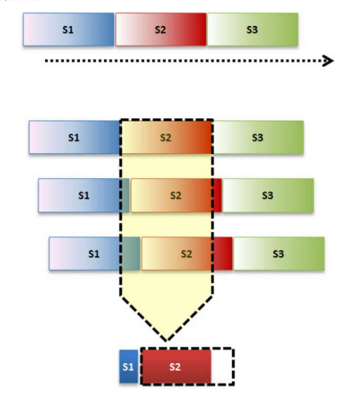

# 什么是Cyclic Prefix

循环前缀(Cyclic Prefix, CP)是将OFDM符号尾部的信号复制到头部构成的。CP的长度主要有两种，分别为常规循环前缀（Normal Cyclic Prefix）和扩展循环前缀（Extended Cyclic Prefix）。

## 传输时延

假设收发机总是能够达到完美同步，即发送机在开始发送符号的同一时刻，接收机开始一个新的符号的接收。

电磁波的传播速度是有限的，等于光速$c = 30\ \text{(km/s)}$.

因为以上两个原因，我们可以观测到如下图的符号传输情况。

![]

## 参考

[What is CP (Cyclic Prefix) in LTE?](https://baike.baidu.com/reference/3907033/78f9Uak_XNGb1oNU6Cy54RrxalkQ837Ubrz-rf4bvQbwbL8Hi8ecKDyT-KH8tVkuh5S4R95yS9HNbA9wtChFQSm5H-QX_SUyUZWia7QCYHDH_Cv-hvB3Mm5l2Fs)